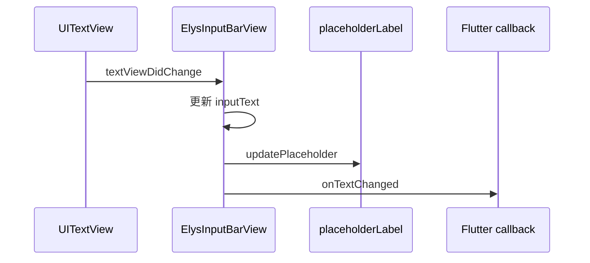

# Engineering Review — diff `origin/main...fix/elys/input-placeholder-paste-dictation`

## 0. 概览

| 项 | 值 |
|---|---|
| 评审对象 | diff-range |
| 目标 | `origin/main...fix/elys/input-placeholder-paste-dictation` |
| 规模 | 1 个 Swift 文件，新增 1 行 |
| 可合并 / 接入状态 | `git merge-tree --write-tree origin/main HEAD` 成功，无冲突 |
| CI / 门禁 | PR 创建前暂无远端 CI；本地 analyze、200 项测试及 iOS Simulator 构建通过 |
| 评审门 | **PASS**（P1：0） |

## 1. 变更性质（按风险画像分类）

- ✏️ 修改既有行为：`UITextView` 接受粘贴、听写或普通输入的新文本后，立即刷新自定义 placeholder 的显隐状态。
- 未新增、删除或调整公开 API、依赖与持久化数据。

## 2. 产品 / 体验影响（before → after）

| 功能 / 产品能力 | 旧体验（before） | 新体验（after） | 优化点 | 体验回退风险 |
|---|---|---|---|---|
| Elys 原生输入栏 | 粘贴或语音听写后，提示词可能继续覆盖已输入文本 | 文本进入输入框后提示词立即隐藏 | 消除文字重叠 | 低；复用既有 `updatePlaceholder()` 判定 |

用户旅程只有“输入文本 → 提示词隐藏”两步，不新增页面或分支状态，无需单独流程图。

## 3. 功能详述

`textViewDidChange` 调用 `syncTextFromTextViewIfNeeded()`。旧实现更新 `inputText` 后直接通知高度和 Dart，漏掉 placeholder 刷新；配置回声又会因 `nextText == inputText` 提前返回。本次在内部文本赋值后调用已有 `updatePlaceholder()`，让 UI 状态在事件上报前同步收敛。

**关键链路 / 既有特性回归检查**：输入事件与 IM 使用场景相关，但发送链路、Dart 回调文本、IME marked text 守卫、前缀删除与高度计算均保持不变；产品预期改变仅为提示词显隐。

## 4. API / 路由

无新增或修改的 API、路由、MethodChannel 方法及事件字段。

## 5. 数据表 / 集合

N/A — 纯客户端 UIKit 状态修复，不涉及数据库或持久化数据。

## 6. 链路图（技术视角）

## 7. 依赖的外部服务 / 第三方

仅使用既有 UIKit `UITextView` / `UILabel` 与 Flutter MethodChannel；无新增第三方服务、配置或凭证。

## 8. 新增依赖、库与内部模块/组件

- 新外部库：无。
- 新内部模块：无。
- 组件改动：既有 `ElysInputBarView` 文本同步分支增加一次状态刷新。

## 9. 改动模块地图

- `ios/Classes/ElysTabBarPlatformView/ElysInputBarView+Prefix.swift`：Elys 原生输入栏文本、前缀和 placeholder 同步。

本次唯一改动文件已逐行审阅，并追踪到 `ElysInputBarView.swift`、`ElysLiquidBarView.swift` 与 Dart 侧 `elys_native_tab_bar.dart` 的调用链。

## 10. 架构合规

| 检查项 | 结果 |
|---|---|
| 平台边界 | ✅ iOS 26 原生交互仍位于插件 Swift 层 |
| 复用既有状态规则 | ✅ 调用已有 `updatePlaceholder()`，未复制显隐条件 |
| Flutter / Native 通信 | ✅ 事件顺序和 payload 不变 |
| Elys 系统边界 | ✅ 未触达 Elys 后端、共享服务或跨服务依赖 |

## 11. 后端可靠性四维度

- 11.1 失效模式：N/A — 同步 UI 属性更新，无网络、进程间工作或长任务。
- 11.2 状态持久化：N/A — `inputText` 与 placeholder 均为视图内瞬时状态。
- 11.3 并发控制：N/A — UIKit 主线程委托回调，无共享持久化状态机。
- 11.4 服务边界：N/A — 不涉及服务、replica、队列或部署拓扑。

## 12. 安全专项

不改变身份、鉴权、输入内容、命令执行、网络请求、LLM prompt 或密钥处理；未发现新增安全风险。

## 13. 前端性能 / 兼容性

新增操作是一次布尔显隐赋值，性能影响可忽略。marked text 分支仍维持原有保护，粘贴、听写、普通键入及文本清空均继续使用统一 placeholder 判定。改动仅影响 iOS 原生 Elys 输入栏。

## 14. 测试覆盖

- 临时回归检查完成失败→通过验证，未加入正式 `test/` 文件。
- `flutter analyze`：通过，无问题。
- `flutter test`：通过，200 项测试全部成功。
- `flutter build ios --simulator --debug`：通过，原生 Swift 编译成功。

现有 Flutter 单测无法直接驱动 iOS `UiKitView` 内部的 `UITextView` 听写事件；真机听写交互仍属于运行时验证范围。

## 15. 可观测性

N/A — 单次确定性 UI 显隐更新没有失败分支，不需要新增日志或指标。

## 16. 冲突状态

无。`git merge-tree --write-tree origin/main HEAD` 成功生成合并树。

## 17. 问题清单

| # | 级别 | 位置 | 问题 | 本对象引入? | 建议修法 | 来源 |
|---|---|---|---|---|---|---|
| 1 | 提示 | iOS 真机交互 | 自动化环境不能完整模拟系统听写 | 否（测试设施限制） | 合并后在 iOS 26 真机执行一次听写冒烟验证 | Codex |

## 18. 结论与建议

- Gate：**PASS**。
- 未发现 P1/P2/P3 问题；修复范围单一，建议合入 `main` 并发布补丁 tag。
