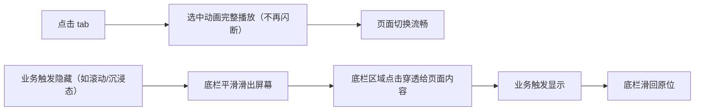
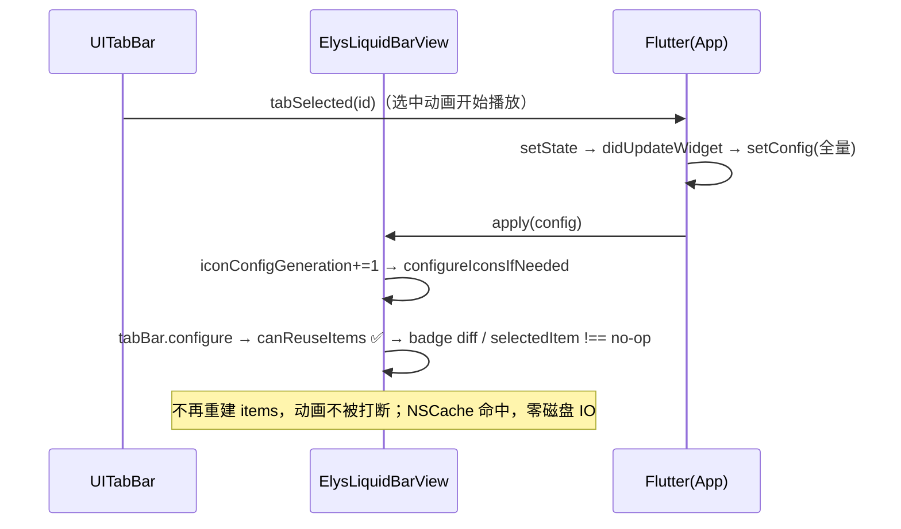
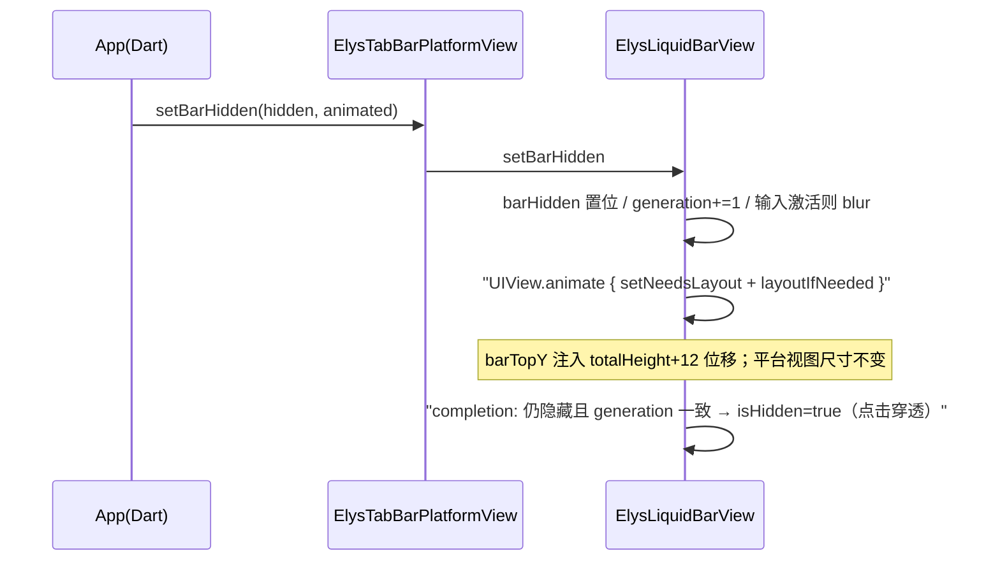

# Engineering Review — diff feat/elys-bar-perf-set-bar-hidden vs main (19a05ec)

## 0. 概览

| 项 | 值 |
|---|---|
| 评审对象 | diff-range（工作区改动 vs origin/main） |
| 目标 | feat/elys-bar-perf-set-bar-hidden，merge-base = 19a05ec |
| 规模 | 7 文件，+182 / −15 |
| 可合并 / 接入状态 | 分支基于 main tip，无冲突可能 |
| CI / 门禁 | 本地已跑：analyze --fatal-infos ✅ / flutter test 200 ✅ / iOS 模拟器构建 ✅；Android example 构建留给 PR CI |
| 评审门 | **PASS**（0 P1，0 P2） |

**业务意图**：实际项目中 Elys 底栏（UiKitView 平台视图）切 tab 掉帧。根因是每次选中态回写触发原生全量重配：无缓存的图标磁盘解码 × 2 遍 + UITabBarItem 全量重建（掐断进行中的液态玻璃选中动画）；且键盘/形态动画期间 layoutSubviews 每帧重载全部图标。本次消除这些主线程开销，并新增原生侧 `setBarHidden` 显隐动画，替代业务侧 SizeTransition 方案（尺寸动画会逐帧 resize 平台视图并触发 Flutter 布局连锁）。

## 1. 变更性质

- ⚡ 图标加载缓存（ElysAssetLoader）— 处理后图像按「路径+尺寸+template」入 NSCache；行为不变，消除重复磁盘 IO/解码
- ⚡ UITabBarItem 复用（ElysRightTabBarView）— tabs 内容未变时不重建 items，badge 就地更新，selectedItem 恒等判断；影响面：所有 setConfig 路径
- ⚡ 图标配置代际门控（ElysLiquidBarView）— configureIcons 从每次 layout 必跑改为「配置代际或实测高度变化」才跑
- 🆕 `setBarHidden`（原生 + Dart controller + demo 开关）— 底栏原生显隐动画，新增 API，无既有行为改动

## 2. 产品 / 体验影响（before → after）

| 功能 / 产品能力 | 旧体验（before） | 新体验（after） | 优化点 | 体验回退风险 |
|---|---|---|---|---|
| 底栏切 tab | 掉帧卡顿；选中动画被掐断闪跳 | 切换流畅，液态玻璃选中动画完整播放 | 主线程消除 ~16 次磁盘 IO/次 | 低（行为等价，见 §3 回归检查） |
| 键盘弹出/输入形态切换 | 动画期间每帧重载全部图标（隐性卡顿源） | 动画期间零图标重载 | 帧预算释放 | 低 |
| 底栏显隐 | 业务侧只能用尺寸动画（掉帧 + 布局连锁） | 原生 UIView 动画平移出屏，不经 Flutter 帧循环 | 新能力 | 新增路径，见 §17 |

**用户旅程流程图**：

## 3. 功能详述

**关键链路 / 既有特性回归检查**（底栏是 App 主导航，按关键链路对待）：

| 路径 | old path | new path | 结论 |
|---|---|---|---|
| tab 点击 → Flutter echo → setConfig | 全量重建 items + 重载图标 ×2 遍 + selectedItem 重设 | canReuseItems 命中 → badge diff 更新 → selectedItem `!==` no-op | 产品预期改变（性能），视觉行为改善 |
| badge 数变化 | 全量重建 | 就地 `setBadgeCount` | 保持不变 |
| tabs 结构变化（id/icon/selectedIcon/a11y） | 全量重建 | canReuseItems 判否 → 全量重建（同旧路径） | 保持不变 |
| isDark 切换 | 重建 items（图标 alwaysOriginal，与 trait 无关）+ overrideUserInterfaceStyle | 仅 overrideUserInterfaceStyle，items 复用 | 保持不变（图标不依赖 trait） |
| iconSize 变化 | 每 layout 重配 | contentHeight 恒为 62（ElysBarMetrics.layout 推导），代际门控正确跳过；真变化时门控放行 | 保持不变 |
| 首次创建 | init apply 配置 items（bounds 零）→ 首次 layout 重配 | init apply 配置（gen=1）→ 首次 layout 门控跳过（值相同） | 保持不变（跳过的是冗余操作） |
| Flutter 程序化切 tab | apply → configure → selectedItem 变更生效 | 同路径，`!==` 判否后赋值生效 | 保持不变 |

## 4. API / 路由

Method channel `elys_platform_ui/tab_bar_<id>` 新增方法：

| 方法 | 参数 | 方向 | 新增/改 |
|---|---|---|---|
| `setBarHidden` | `{hidden: bool, animated: bool}` | Dart → 原生 | 新增 |

Dart 公开 API：`ElysNativeTabBarController.setBarHidden(bool, {bool animated})`，新增，非破坏性。

## 5. 数据表 / 集合

N/A — 纯客户端 UI 包，无持久化。

## 6. 链路图

tab 切换回写路径（修复后）：

setBarHidden 路径：

## 7. 依赖的外部服务 / 第三方

N/A — 无新外部依赖；仅 UIKit/Flutter 既有依赖。

## 8. 新增依赖、库与内部模块/组件

- 新 npm/外部库：无（pubspec/podspec 零改动）
- 原生：`ElysAssetLoader` 新增静态 NSCache 与 `processedImage` 收敛入口；`ElysRightTabBarView` 新增 `canReuseItems`；`ElysLiquidBarView` 新增代际门控与 `setBarHidden`
- Dart：controller 新增 `setBarHidden`；demo 页新增显隐开关

## 9. 改动模块地图

- `ios/Classes/ElysTabBarPlatformView/`（5 文件）— 核心改动，逐行已审
- `lib/src/widgets/ios26/`（1 文件）— controller API，逐行已审
- `example/`（1 文件）— demo 开关，逐行已审

垂直切片：原生实现 + Dart API + demo，无配置/依赖改动。

## 10. 架构合规

| 检查项 | 结果 |
|---|---|
| flutter_lints（仓库唯一显式规则） | ✅ analyze --fatal-infos 零告警 |
| 既有代码风格（中文约束注释、generation-counter 防竞态模式） | ✅ 沿用 `barControlsRestoreGeneration` 同款模式 |
| 平台视图尺寸不可变约束（本仓库 #13/#14 修复延续的方向） | ✅ setBarHidden 全程不改平台视图尺寸 |
| 缓存边界 | ✅ 仅缓存不可变 bundle 资源；file://、绝对路径、~/ 排除（动态头像场景） |

## 11. 后端可靠性四维度

非分布式后端，按适用面收敛评估：

- **11.1 失效模式**：方法调用为主线程同步执行，无跨进程失效面。动画中断竞态由 `barHiddenRestoreGeneration` 守卫（隐藏未完成即显示 → 旧 completion 的 `isHidden=true` 被代际判否）。✅
- **11.2 真值归属**：`barHidden` 真值只在原生侧，**不进 creationParams/setConfig**。平台视图若被 Flutter 重建（如页面销毁重建），bar 回到可见态而业务侧仍认为隐藏 → 见 §17-1（P3）。对比：`inputActive`/`selectedTabId` 均走 config 同步，此为新增的不对称。
- **11.3 并发控制**：全部主线程，无并发写。两个 generation counter（icon 代际 / 显隐动画代际）各自单调递增，无交叉污染。✅
- **11.4 拓扑**：N/A — 进程内 UI 组件。

## 12. 安全专项

- 输入校验：method channel 参数均 `as? NSNumber` 安全解包，缺省有默认值 ✅
- 缓存投毒面：NSCache key 含完整路径+尺寸+template，无跨资源碰撞 ✅
- 密钥/LLM/注入：N/A — 无相关面

## 13. 前端性能 / 兼容性

本 PR 的核心即性能：

- 切 tab 主线程开销：修复前 ~16 次磁盘读+解码+重绘（4 tab × 2 图 × 2 遍）+ items 重建 ×2；修复后 ~0（缓存命中 + 复用路径）
- 键盘/形态动画：每帧图标重载 → 零重载（代际门控）
- `setBarHidden`：UIView 动画原生执行，Flutter 帧循环零参与，平台视图零 resize
- 兼容性:仅 iOS 26+ 路径（`@available(iOS 26.0, *)` 既有约束），Android/低版本不受影响（Dart 侧 `Platform.isIOS` 分支既有）
- **需实测**：真机动画手感与 Instruments 帧率验证（模拟器无法注入原生 UITabBar 触摸）

## 14. 测试覆盖

- Dart 侧 200 个既有测试全绿；controller 新方法为薄封装（channel 为空时 no-op，与全部既有方法一致模式）
- 原生 Swift 侧无单测——仓库既有状况（全部平台视图代码均无 XCTest target），本 PR 未恶化也未改善
- 缺口：canReuseItems 的 diff 逻辑、setBarHidden 状态机最适合原生单测，列为 follow-up

## 15. 可观测性

N/A — UI 组件包，无日志/埋点面；失败路径（图标加载失败）沿用既有静默返回 nil 行为，未引入新的吞错。

## 16. 冲突状态

N/A — 分支基于 main tip（19a05ec），零冲突。

## 17. 问题清单

| # | 级别 | 位置 | 问题 | 本对象引入? | 建议修法 | 来源 |
|---|---|---|---|---|---|---|
| 1 | P3 | ElysLiquidBarView+State.swift `setBarHidden` | `barHidden` 不在 creationParams/setConfig 同步链里，平台视图重建后回到可见态，与业务侧状态脱钩 | 是 | follow-up：把 `barHidden` 纳入 `ElysBarConfig` 并在 apply 时恢复（不动画） | Claude |
| 2 | 提示 | 同上 | 隐藏动画 ~320ms 窗口内 `isHidden` 未置位，bar 区域点击仍被 rootView 吞掉 | 是 | 可接受（过渡期语义）；如需严格，动画开始即置 `isUserInteractionEnabled=false` | Claude |
| 3 | 提示 | elys_native_tab_bar_controller.dart | 隐藏期间 `focusInput`/`setInputActive(true)` 仍生效，会在不可见 bar 上激活输入 | 是 | 文档已约定业务侧责任；如需硬约束，原生侧 guard `barHidden` | Claude |
| 4 | 提示 | ElysAssetLoader.swift | NSCache 未设 countLimit/costLimit | 是 | 图标量级小（每 tab 2 张 36pt 图），系统内存压力自动驱逐，可不设 | Claude |

## 18. 结论与建议

- Gate：**PASS**
- 推进建议：可直接合入。P3-1（barHidden 进 config 同步）建议作为独立 follow-up PR，因为涉及 config 签名与 Dart 侧 widget 参数设计，不宜混入本次性能范围。真机帧率与动画手感验证在合入后回归（demo 页右上角开关）。
